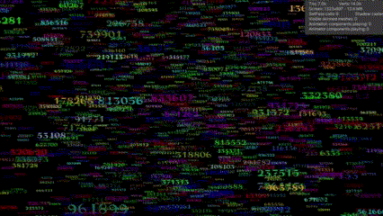

# damage-numbers-DOTS
Show thousands of damage numbers in DOTS.

It uses a hacky technique to draw numbers on GPU instanced quads.
To draw 648, this code block
```
                float texturePitPoint = myNumber / 10;
                float uvProgress = input.uv.x - myNumberIndex / numberCount;
                float textureProgress = uvProgress * numberCount / 10;
                float fX = texturePitPoint + textureProgress;
                float2 uv = float2(fX, input.uv.y * _UVY.x - _UVY.y);
```

draw the pixel color like this:
 <br>
to achieve this:
 <br>
